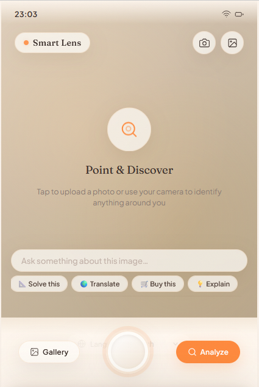
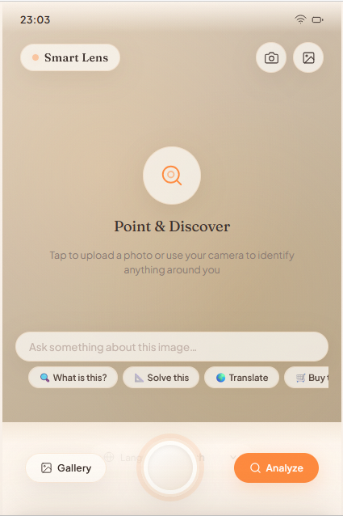

# SmartLens 🔍

SmartLens is an AI-powered image analysis system that integrates multiple computer vision techniques into a single application. It allows users to upload images and automatically extract meaningful information such as detected objects, text, and barcodes.

## 🚀 Features

* 🧠 Object Detection using YOLOv8
* 🔤 Text Extraction using OCR
* 📦 Barcode & QR Code Scanning
* 🌐 Language Translation

## 🛠️ Tech Stack

* Python
* Flask
* OpenCV
* YOLOv8 (Ultralytics)
* Tesseract OCR

## ⚙️ How It Works

1. User uploads an image through the web interface
2. Image is preprocessed for better accuracy
3. System processes image using:

   * Object Detection (YOLOv8)
   * OCR (Text Recognition)
   * Barcode/QR Scanner
4. Results are displayed on the screen

## 🧠 System Architecture

User Input → Flask Backend → AI Modules (YOLO + OCR + Barcode) → Output Display

## 📂 Project Structure

```
SmartLens/
│
├── app.py
├── analyze.py
├── detect.py
├── ocr.py
├── barcode.py
├── translator.py
├── requirements.txt
│
├── static/
│   ├── style.css
│   └── script.js
│
├── templates/
│   └── index.html
│
├── README.md
├── .gitignore
```

---

## ⚙️ Installation

1. Clone the repository:

```
git clone https://github.com/Tanya-869/SmartLens.git
```

2. Navigate to project folder:

```
cd SmartLens
```

3. Install dependencies:

```
pip install -r requirements.txt
```

4. Run the application:

python app.py


## 🏠 Homepage





## 🔍 Object Detection


## 🔤 OCR


## 📦 Barcode Scanner


## 📌 Note

* YOLO model weights (.pt files) are not included due to size limitations
* Download models from: https://github.com/ultralytics/ultralytics

